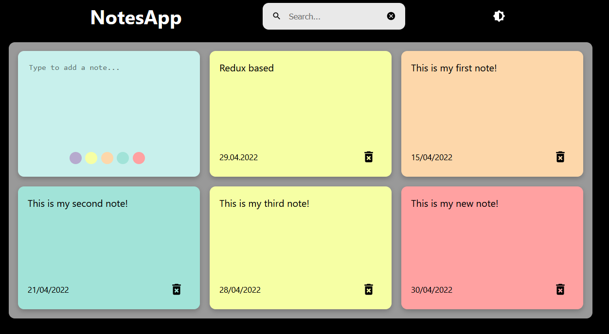

# what is that?
This is a note taking app mainly build by [Chris Blakely](https://github.com/chrisblakely01/react-notes-app) re-developed and edited by [Me (ismail-sk)](https://github.com/ismail-sk/) for my react and redux learning studies on [patika.dev](https://app.patika.dev/courses/redux).
 
This is a homework for [patika.dev redux homework 1 ](https://app.patika.dev/courses/redux/todo-app-odev)

This is REDUX toolkit based version. please check src folder for redux storage components

For live:
https://pati-hw1-note.surge.sh/

